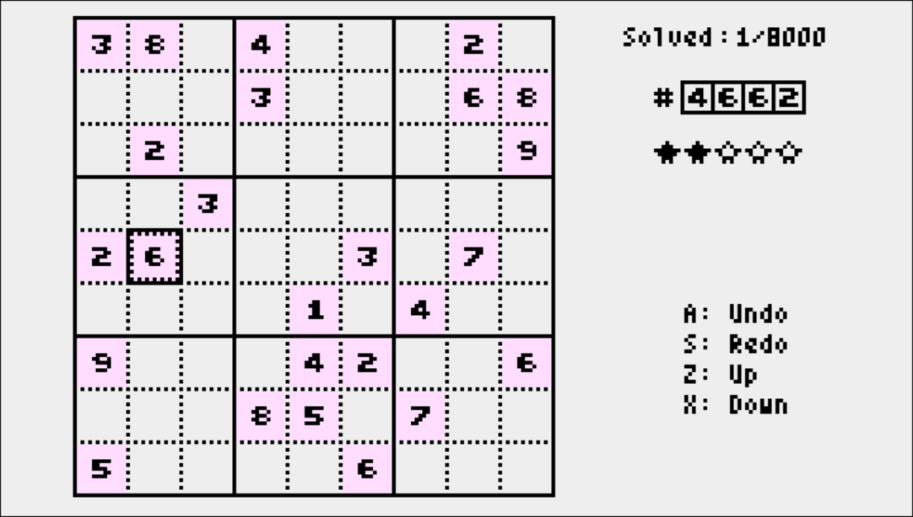

# sudoku-8000
A port of TIC-80's [SUDOKU8000](https://tic80.com/play?cart=4203) to uxn.
# 
## Starting the Game
Start the game with the following command.  
```uxnemu sudoku-8000.rom```
## Gameplay Overview
### Selecting a Sudoku Puzzle 
When launched, a randomly selected unsolved Sudoku puzzle will be displayed. To select another Sudoku puzzle randomly, press the F4 key to restart.  
You can directly select a Sudoku puzzle by changing the four-digit number in the top right corner.  
### Inputting Numbers
Use the arrow keys to move the cursor and the Z and X keys to increase or decrease numbers. You can also use the mouse; in that case, use the left and right buttons to increase or decrease numbers.
## Saving and Clearing Game Progress
Information about which Sudoku puzzles have been solved is saved in a 1KB file called "sudoku-8000.mem". To clear the information, delete the "sudoku-8000.mem" file.
## Building from Source
"run.sh" is a build script for Linux. When executed, it generates "sudoku-8000.rom".
## Notes
### Sound effects
We used the export command from TIC-80 to extract a WAV file, which was converted to mono using Audacity and exported in RAW format as unsigned 8-bit PCM at 22050 Hz.
### Game data generation
We have programmatically generated 8,000 Sudoku puzzles with unique solutions. Using solutions generated with Alloy as a base, we apply a method that randomly increases the number of blank spaces while maintaining the condition of having a unique solution.
#### Data format
Each Sudoku puzzle's data is stored in 32 bytes. The internal format of the 32 bytes is as follows:  
```
|-------+-------------|
|  byte | description |
|-------+-------------|
|   0-3 | row1        |
|   4-7 | row2        |
|  8-11 | row3        |
| 12-15 | row4        |
| 16-19 | row5        |
| 20-23 | row6        |
| 24-27 | row7        |
| 28-31 | row8        |
|-------+-------------|
```
row1 to row8 each consist of 4 bytes. row1 to row7 contain the solutions for each row, the positions of blank spaces, information on whether a specific column in the 9th row is blank or not, and one particular bit of metadata (7 bits) representing the difficulty level of the Sudoku. row8 consists of the solution for the 8th row, the positions of blank spaces, and information on whether the last two specific columns in the 9th row are blank. The internal format of these 4 bytes is described below.

row1 to row7
```
|-------+--------------------------------|
|   bit | description of row-n           |
|-------+--------------------------------|
|    31 | 0 (unused)                     |
| 30-11 | solution                       |
|    10 | 0:column 1 of row-n is blank   |
|     9 | 0:column 2 of row-n is blank   |
|   ... |             ...                |
|     3 | 0:column 8 of row-n is blank   |
|     2 | 0:column 9 of row-n is blank   |
|     1 | bit-n of metadata              |
|     0 | 0:column n of 9th row is blank |
|-------+--------------------------------|
```
row8
```
|-------+--------------------------------|
|   bit | description of row8            |
|-------+--------------------------------|
|    31 | 0 (unused)                     |
| 30-11 | solution                       |
|    10 | 0:column 1 of row8 is blank    |
|     9 | 0:column 2 of row8 is blank    |
|   ... |             ...                |
|     3 | 0:column 8 of row8 is blank    |
|     2 | 0:column 9 of row8 is blank    |
|     1 | 0:column 8 of 9th row is blank |
|     0 | 0:column 9 of 9th row is blank |
|-------+--------------------------------|
```
`solution` is the number assigned to the permutation of nine digits from 1 to 9. 0 corresponds to (1,2,3,4,5,6,7,8,9), and 362879 corresponds to (9,8,7,6,5,4,3,2,1).
The solution for each column in the 9th row is determined by the numbers that do not appear in rows 1 to 8.
Bit 31 of r1 to r8 is fixed at 0. These 8 bits in total may potentially be used for some purpose in the future. The current program assumes that bit 31 is 0 and treats it as the most significant bit of the solution, so some minor modifications may be necessary.
